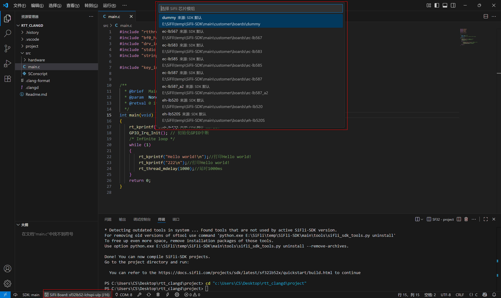
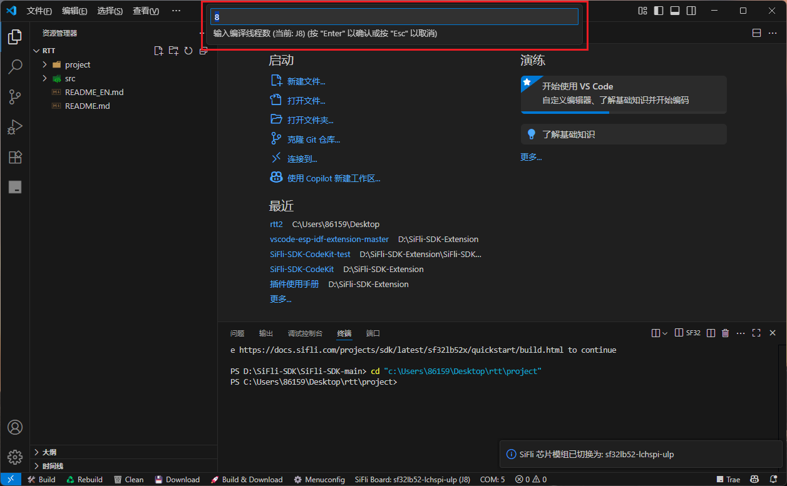
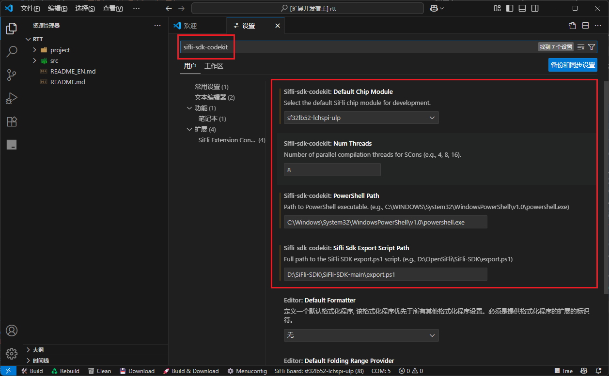
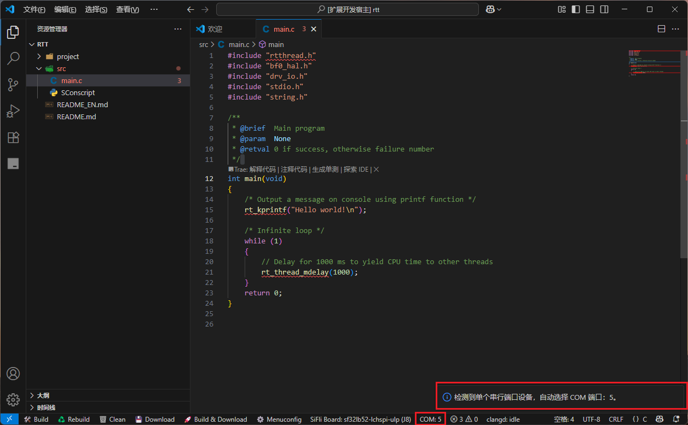
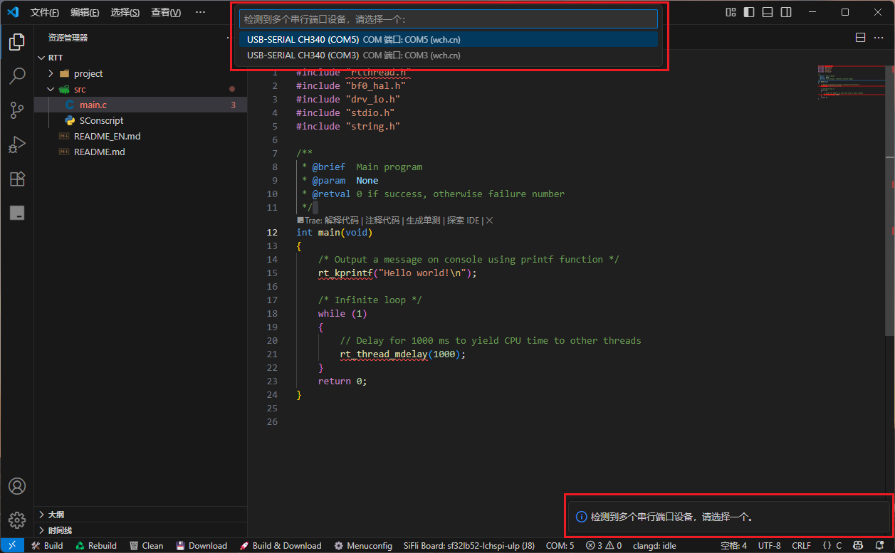

# sifli-sdk-codekit - VS Code 插件

[English](./README_EN.md)

`sifli-sdk-codekit` 是一款用于简化 SiFli-SDK 项目开发的 Visual Studio Code 插件。它提供一系列便捷的操作入口，帮助用户高效完成项目管理、编译、下载及配置等工作。

---

## 🚀 插件版本更新日志

### v1.0.5

- 串口切换功能集成至状态栏，用户可点击 `COM:` 进行串口选择，后续下载操作将自动使用当前选择的串口。
- 新增对除 CH340 外其他串口型号的支持。
- 替换原有串口下载脚本为 `sftool` 指令，解决旧方案中运行后出现字符被吞问题。

### v1.0.4

- 优化整体使用体验。
- 支持在状态栏左下角点击 `SiFLi Board` 进行芯片模组切换与线程数选择。
- 同时保留 VS Code 设置界面中修改芯片模组的方式。

### v1.0.3

- 新增支持多款 SiFli 芯片模组，包括：
  - sf32lb52 系列：lcd_52d、lcd_base、lcd_n16r8、lchspi-ulp、lchspi-ulp_base、nano_52b、nano_52j、nano_base
  - sf32lb56 系列：lcd_a128r12n1、lcd_base、lcd_n16r12n1
  - sf32lb58 系列：lcd_a128r32n1_dsi、lcd_base、lcd_n16r32n1_dpi、lcd_n16r32n1_dsi、lcd_n16r64n4

- 首次激活插件时引导选择芯片模组，默认选择为 `sf32lb52-lchspi-ulp（黄山派）`。

### v1.0.2

- 增强串口自动识别功能，自动处理 USB-SERIAL CH340 串口设备：
  - 无串口时提示检查连接；
  - 单个设备自动使用；
  - 多个设备时弹出选择框。

### v1.0.1

- 初始版本，支持项目编译、下载、清理、重新编译、打开 Menuconfig 等操作。
- 自动判断是否处于 SiFli 工程，自动保存未保存文件。
- 支持自定义 PowerShell 路径与 SDK 脚本路径。

---

## 📂 项目目录结构

    sifli-sdk-codekit

    +---.vscode
    |   |
    |   +---launch.json                 // VS Code 调试配置文件。
    |
    +---images/readme                          // 插件的使用说明图片
    |
    +---extension.js                    // 插件的主入口文件。
    |
    +---package.json                    // 插件的清单文件。
    |
    +---LICENSE.txt                     // 许可证文件。
    |
    +---README_CN.md                    // 项目的中文说明文档。
    |
    +---README_EN.md                    // English documentation

---

## ✨ 插件核心功能

- **自动识别 SiFli 工程**
  - 判断标准：根目录包含 `src/SConscript`
  - 仅在满足条件时激活插件状态栏功能

- **状态栏功能按钮**
  - 🛠️ Build：一键编译
  - ♻️ Rebuild：清理并重新编译
  - 🗑️ Clean：清理构建产物
  - 💾 Download：自动识别串口并下载
  - 🚀 Build & Download：编译后自动下载
  - ⚙️ Menuconfig：打开图形化配置界面
  - SIFLI Board：选择开发芯片模组与线程数
  - COM：切换串口设备

- **串口自动识别机制**
  - 通过 PowerShell 检测串口设备（CH340 为主）
  - 单个设备自动选择
  - 多设备弹窗选择
  - 无设备提示用户

- **自动保存机制**
  - 所有任务执行前会保存所有文件，避免旧代码编译

- **可配置项**
  - PowerShell 路径（如：`C:\Windows\System32\WindowsPowerShell\v1.0\powershell.exe`）
  - SDK 脚本路径（如：`D:\OpenSiFli\SiFli-SDK\export.ps1`）

---

## ⚙️ 使用指南

### 安装插件

1. 打开 VS Code。
2. 快捷键 `Ctrl+Shift+X` 进入插件市场。
3. 搜索 `sifli-sdk-codekit` 并安装。
4. 安装示意图如下：
   

### 插件配置

- **选择芯片模组与线程数**
  - 点击状态栏 `SIFLI Board` 进行选择
  - 
  - 

- **配置 SDK 路径**
  - 打开设置（`文件 -> 首选项 -> 设置`）
  - 搜索 `sifli-sdk-codekit`
  - 填写 PowerShell 路径与 `export.ps1` 脚本路径
  - 

---

## 🔄 串口切换演示

- **单个串口设备时自动选择**
  

- **多个串口设备时弹窗选择**
  

---

## ❓ 常见问题（FAQ）

**Q1：为什么插件没有激活？**

- 请确认项目根目录是否存在 `src/SConscript` 文件。

**Q2：命令执行失败怎么办？**

- 检查 PowerShell 路径、SDK 脚本路径是否正确。
- 确认 SDK 环境和依赖（如 scons、sftool）是否正常。

**Q3：终端没有自动进入 project 文件夹？**

- 请确保根目录中存在名为 `project` 的子文件夹。

**Q4：串口设备未识别？**

- 打开设备管理器，检查串口驱动、连接状态、PowerShell 执行权限。

**Q5：还有其他未知问题？**

- 欢迎提交 issue，这对插件的后续开发很有帮助：[GitHub 仓库](https://github.com/OpenSiFli/SiFli-SDK-CodeKit)

---
