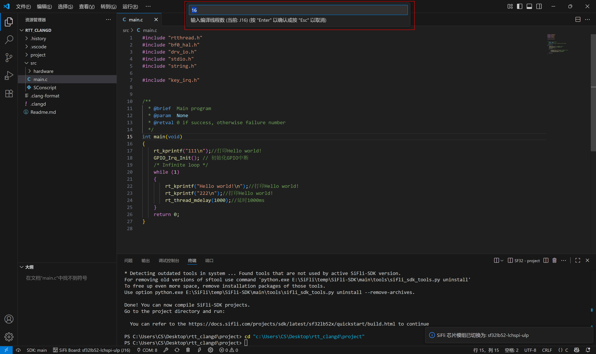

# sifli-sdk-codekit - VS Code 插件

[English](./README_EN.md)

`sifli-sdk-codekit` 是一款用于简化 SiFli-SDK 项目开发的 Visual Studio Code 插件。它提供一系列便捷的操作入口，帮助用户高效完成项目管理、编译、下载及配置等工作。

---

## 🚀 插件版本更新日志

### v1.1.3

- 新增串口监视器，根据串口设置简单配置调试助手，调试信息查看更方便。
- 增加插件侧边栏，环境搭建更便捷，一站式开发。
- 增加对自定义板子的支持。

### v1.1.0

- 新增SDK管理器，提供多种不同版本SDK及其相关工具链下载功能，一键式安装。
- 新增SDK版本切换功能，用户可在插件中切换不同版本的SDK，方便进行项目开发。
- 优化了插件烧录指令，烧录更加高效稳定。
- 优化了状态栏UI界面。

### v1.0.5

- 串口切换功能集成至状态栏，用户可点击 `COM:` 进行串口选择，后续下载操作将自动使用当前选择的串口。
- 新增对除 CH340 外其他串口型号的支持。
- 替换原有串口下载脚本为 `sftool` 指令，解决旧方案中运行后出现字符被吞问题。

### v1.0.4

- 优化整体使用体验。
- 支持在状态栏左下角点击 `SiFLi Board` 进行芯片模组切换与线程数选择。
- 同时保留 VS Code 设置界面中修改芯片模组的方式。

### v1.0.3

- 新增支持多款 SiFli 芯片模组，包括：
  - ec 系列：
    - lb551xxx、lb555xxx、lb557xxx、lb561xxx、lb563xxx、lb567、lb583、lb585、lb587、lb587_a2
  - eh 系列：
    - lb52xu、lb56xu、lb520、lb520s、lb523、lb523_dual、lb525、lb551、lb555、lb561、lb563、ss6500、ss6700
  - sf32lb52 系列：
    - core:core_52j_e8、core_52j_n16、core_base、core_e8r16、core_n16r16
    - lcd :lcd_52d、lcd_a128r16、lcd_base、lcd_n16r8、lcd_n16r8_jdi、lcd_lchspi-ulp、lcd_lchspi-ulp_base
    - nano:nano_52b、nano_52j、nano_52j_a128、nano_a128r16、nano_base、nano_n4、nano_n16r16
  - sf32lb56 系列：
    - lcd :lcd_a128r12n1、lcd_base、lcd_n16r12n1
  - sf32lb58 系列：
    - lcd :lcd_a128r32n1_dsi、lcd_base、lcd_n16r32n1_dpi、lcd_n16r32n1_dsi、lcd_n16r64n4

- 首次激活插件时引导选择芯片模组，注意黄山派模组为 `sf32lb52-lchspi-ulp`。

### v1.0.2

- 增加串口自动识别功能，自动处理串口设备：
  - 无串口时提示检查连接；
  - 单个设备自动使用；
  - 多个设备时弹出选择框。

### v1.0.1

- 初始版本，支持项目编译、下载、清理、重新编译、打开 Menuconfig 等操作。
- 自动判断是否处于 SiFli 工程，自动保存未保存文件。
- 支持自定义 PowerShell 路径与 SDK 脚本路径。

---

## 📂 项目目录结构

    sifli-sdk-codekit

    +---.vscode                         // VS Code 配置文件夹
    |
    +---images/readme                   // 插件的使用说明图片
    |
    +---src                             // 插件的主入口文件
    |
    +---webview-vue                     // 插件的webview界面
    |
    +---script                          // 插件的脚本
    |
    +---LICENSE                         // 许可证文件
    |
    +---package.json                    // 插件的package.json文件，定义了插件的元数据和依赖项
    |
    +---tsconfig.json                   // TypeScript 配置文件
    |
    +---yarn.lock                       // 用于锁定项目依赖项的版本，确保团队成员使用相同的依赖版本
    |
    +---README.md                       // 项目的中文说明文档
    |
    +---README_EN.md

---

## ✨ 插件核心功能

- **自动识别 SiFli 工程**
  - 判断标准：根目录包含 `src/SConscript`
  - 仅在满足条件时激活插件状态栏功能

- **状态栏功能按钮**
  - 

  - SDK管理器入口
  - SDK版本切换
  - 选择开发芯片模组与编译线程数
  - 选择串口设备
  - 编译
  - 清除并重新编译
  - 清理构建产物
  - 烧录下载
  - 进入menuconfig设置界面
  - 串口监视器

- **串口自动识别机制**
  - 自动检测串口设备
  - 单个设备自动选择
  - 多设备弹窗选择
  - 无设备提示用户

- **SDK管理器**
  - 新增SDK管理器，实现SDK和工具链的一键下载，通过SDK管理器下载的SDK无需额外配置终端地址和SDK脚本路径
  - 增加SDK版本切换功能，点击即可迅速完成不同SDK版本之间的切换

- **对自定义板子的指令支持**
  - 在与project同级目录下创建boards存放板子，插件可自动识别，点击SiFli Board即可切换
  - 对于在其他路径(非SDK\customer\boards，非project同级目录下的boards)，在设备中搜索`Sifli-sdk-codekit: Custom Board Search Path`填入板子路径即可完成
---

## 使用指南

### 安装插件

1. 打开 VS Code。
2. 快捷键 `Ctrl+Shift+X` 进入插件市场。
3. 搜索 `sifli-sdk-codekit` 并安装。
4. 安装示意图如下：
   

### SDK管理器使用

- **打开SDK管理器(通过插件侧边栏打开或者点击状态栏按钮)**
  

- **选择安装方式**
  

- **选择SDK下载版本**
  
  - 注意当不指定工具链目录路径时，默认的工具链安装路径为`C:\Users\name\.sifli`
  - 指定工具路径下载时，插件会在使用过程中，导出环境变量`SIFLI_SDK_TOOLS_PATH`

- **SDK安装日志**
  

- **SDK安装完成**
  

- **对自定义安装工具链用户的支持**
  

### 插件配置

- **选择芯片模组与线程数**
  - 点击状态栏 `SIFLI Board` 进行选择
  - 
  - 

---

### 串口切换演示

- **选择切换串口设备**
  

### 对自定义板子的指令支持

- **对project同级目录下的boards**
  

- **对于自定义路径下的boards**
  - 在设置中配置自定义的板子路径
  
  
  - 填写完毕后即可在插件中查看到板子
  
---

## ❓ 常见问题（FAQ）

**Q1：为什么插件没有激活？**

- 请确认项目根目录是否存在 `src/SConscript` 文件。

**Q2：命令执行失败怎么办？**

- 检查 PowerShell 路径、SDK 脚本路径是否正确。
- 确认 SDK 环境和依赖（如 scons、sftool）是否正常。

**Q3：终端没有自动进入 project 文件夹？**

- 请确保根目录中存在名为 `project` 的子文件夹。

**Q4：串口设备未识别？**

- 打开设备管理器，检查串口驱动、连接状态、PowerShell 执行权限。

**Q5：还有其他未知问题？**

- 欢迎提交 issue，这对插件的后续开发很有帮助：[GitHub 仓库](https://github.com/OpenSiFli/SiFli-SDK-CodeKit)

---
