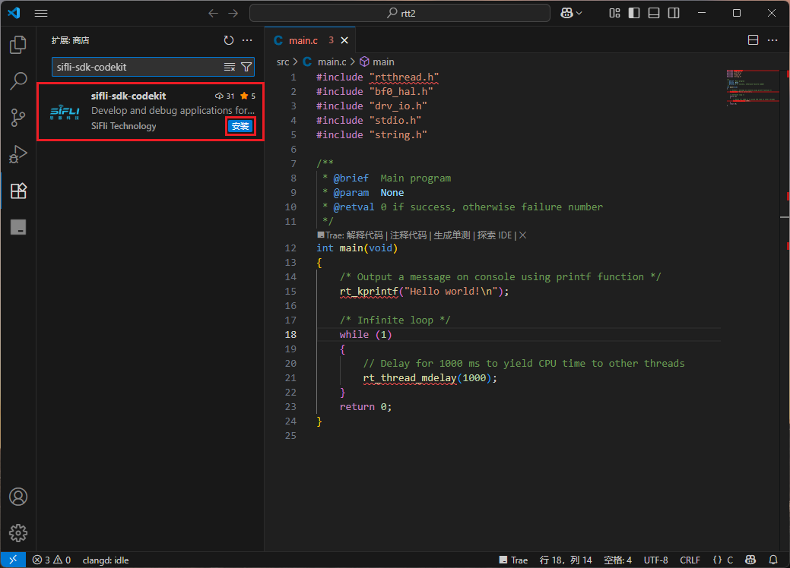

# sifli-sdk-codekit - VS Code Extension

[中文](./README_CN.md)

`sifli-sdk-codekit` is a Visual Studio Code extension designed to simplify the development process of SiFli-SDK projects. It provides intuitive buttons and utilities for managing, building, downloading, and configuring your projects efficiently.

---

## 🚀 Changelog

### v1.0.5
- Added serial port switching in the status bar. You can now click `COM:` to select the active serial device, which will be used automatically in download operations.
- Added support for serial devices beyond `USB-SERIAL CH340`.
- Replaced the old download script with `sftool` to resolve character loss issues during download operations.

### v1.0.4
- Improved user experience.
- You can now click `SiFLi Board` in the lower-left status bar to select your chip module and thread count.
- Still supports configuration through VS Code settings.

### v1.0.3
- Added support for various SiFli chip modules:

  - sf32lb52 series: lcd_52d, lcd_base, lcd_n16r8, lchspi-ulp, lchspi-ulp_base, nano_52b, nano_52j, nano_base
  - sf32lb56 series: lcd_a128r12n1, lcd_base, lcd_n16r12n1
  - sf32lb58 series: lcd_a128r32n1_dsi, lcd_base, lcd_n16r32n1_dpi, lcd_n16r32n1_dsi, lcd_n16r64n4

- On first activation, the plugin prompts users to select a chip module (defaults to `sf32lb52-lchspi-ulp` if none selected).

### v1.0.2
- Enhanced serial port auto-detection for `USB-SERIAL CH340`:
  - Prompts when no serial device is found.
  - Auto-selects when only one device is found.
  - Displays selection UI when multiple are detected.

### v1.0.1
- Initial release:
  - Supports build, download, clean, rebuild, and Menuconfig.
  - Auto-detects SiFli projects and auto-saves unsaved files.
  - Allows users to configure PowerShell path and SDK script path.

---

## 📂 Project Directory Structure

    sifli-sdk-codekit

    +---.vscode
    |   |
    |   +---launch.json                 // VS Code debug config
    |
    +---images/readme                   // Usage images/readme for the extension
    |
    +---extension.js                    // Main entry script
    |
    +---package.json                    // Manifest file
    |
    +---LICENSE.txt                     // License
    |
    +---README_CN.md                    // 项目的中文说明文档。
    |
    +---README_EN.md                    // English documentation

---

## ✨ Key Features

- **Auto-detect SiFli Projects**
  - A project is recognized if `src/SConscript` exists in the workspace root.
  - Status bar features are only activated under valid SiFli projects.

- **Status Bar Buttons**
  - 🛠️ Build: Build the project
  - ♻️ Rebuild: Clean and build
  - 🗑️ Clean: Remove build artifacts
  - 💾 Download: Detect serial port and download firmware
  - 🚀 Build & Download: Build and auto-download
  - ⚙️ Menuconfig: Open the graphical config interface
  - SIFLI Board: Select chip module and thread count
  - COM: Choose active serial port

- **Serial Port Auto-Detection**
  - Uses PowerShell to detect connected serial ports (mainly CH340)
  - Automatically uses the only found port
  - Prompts user if multiple are found
  - Notifies user when none are detected

- **Auto-Save Files**
  - All open files are saved before running any task to ensure consistency

- **Configurable Settings**
  - PowerShell path (e.g., `C:\Windows\System32\WindowsPowerShell\v1.0\powershell.exe`)
  - SDK export script path (e.g., `D:\OpenSiFli\SiFli-SDK\export.ps1`)

---

## ⚙️ Getting Started

### Installation

1. Open VS Code.
2. Use shortcut `Ctrl+Shift+X` to open the Extensions Marketplace.
3. Search for `sifli-sdk-codekit` and install it.
4. Installation UI example:  
   

### Configuration

- **Select Chip Module and Thread Count**
  - Click `SIFLI Board` in the status bar.
  - 
  - 

- **Configure SDK Paths**
  - Open `File -> Preferences -> Settings`
  - Search `sifli-sdk-codekit`
  - Set the following:
    - PowerShell executable path
    - `export.ps1` full script path
  - 

---

## 🔄 Serial Port Selection Demo

- **Single Serial Port Auto-Selected**
  

- **Multiple Devices - Manual Selection**
  

---

## ❓ FAQ

**Q1: Why isn't the extension activated?**  
- Make sure your workspace root contains the `src/SConscript` file.

**Q2: Command execution fails?**  
- Check if PowerShell path and SDK script path are correctly configured.
- Ensure your SiFli-SDK environment is valid and required tools (`scons`, `sftool`, etc.) are accessible.

**Q3: Terminal didn’t switch to the `project` directory?**  
- Make sure your workspace contains a `project` folder at the root level.

**Q4: Serial port not detected?**  
- Check if the serial device is connected and powered.
- Verify correct driver installation in Device Manager.
- Ensure PowerShell can execute commands with appropriate permissions.

**Q5: Unknown issue?**  
- Feel free to open an issue on GitHub to help improve the extension:  
  [GitHub Repository](https://github.com/OpenSiFli/SiFli-SDK-CodeKit)

---
