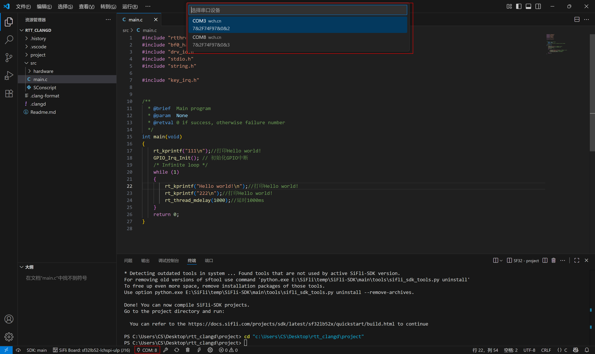

# sifli-sdk-codekit - VS Code Extension

[中文](./README.md)

`sifli-sdk-codekit` is a Visual Studio Code extension designed to simplify the development process of SiFli-SDK projects. It provides intuitive buttons and utilities for managing, building, downloading, and configuring your projects efficiently.

---

## 🚀 Changelog

### v1.1.0
- Added a new SDK Manager, which provides one-click download and installation for various SDK versions and their related toolchains.
- Added a new SDK version switching feature, allowing users to switch between different SDK versions within the extension for convenient project development.
- Optimized the download command, making firmware flashing more efficient and stable.
- Optimized the status bar UI.

### v1.0.5
- Added serial port switching in the status bar. You can now click `COM:` to select the active serial device, which will be used automatically in download operations.
- Added support for serial devices.
- Replaced the old download script with `sftool` to resolve character loss issues during download operations.

### v1.0.4
- Improved user experience.
- You can now click `SiFLi Board` in the lower-left status bar to select your chip module and thread count.
- Still supports configuration through VS Code settings.

### v1.0.3
- Added support for various SiFli chip modules:
  - sf32lb52 series: lcd_52d, lcd_base, lcd_n16r8, lchspi-ulp, lchspi-ulp_base, nano_52b, nano_52j, nano_base
  - sf32lb56 series: lcd_a128r12n1, lcd_base, lcd_n16r12n1
  - sf32lb58 series: lcd_a128r32n1_dsi, lcd_base, lcd_n16r32n1_dpi, lcd_n16r32n1_dsi, lcd_n16r64n4

- On first activation, the plugin prompts users to select a chip module (defaults to `sf32lb52-lchspi-ulp` if none selected).

### v1.0.2
- Enhanced serial port auto-detection:
  - Prompts when no serial device is found.
  - Auto-selects when only one device is found.
  - Displays selection UI when multiple are detected.

### v1.0.1
- Initial release:
  - Supports build, download, clean, rebuild, and Menuconfig.
  - Auto-detects SiFli projects and auto-saves unsaved files.
  - Allows users to configure PowerShell path and SDK script path.

---

## 📂 Project Directory Structure

    sifli-sdk-codekit

    +---.vscode                         // VS Code configuration folder
    |
    +---images/readme                   // Usage images for the extension
    |
    +---src                             // Main entry file for the extension
    |
    +---webview-vue                     // Webview interface for the extension
    |
    +---script                          // Scripts for the extension
    |
    +---LICENSE                         // License file
    |
    +---package.json                    // Manifest file, defines extension metadata and dependencies
    |
    +---tsconfig.json                   // TypeScript configuration file
    |
    +---yarn.lock                       // Locks project dependencies to ensure consistent versions across the team
    |
    +---README.md                       // Chinese documentation
    |
    +---README_EN.md                    // English documentation

---

## ✨ Key Features

- **Auto-detect SiFli Projects**
  - A project is recognized if `src/SConscript` exists in the workspace root.
  - Status bar features are only activated under valid SiFli projects.

- **Status Bar Buttons**
  - 
  - SDK Manager entry
  - SDK version switching
  - Select development chip module and compilation thread count
  - Select serial device
  - Build
  - Rebuild (clean and rebuild)
  - Clean build artifacts
  - Download firmware
  - Enter menuconfig settings interface

- **Serial Port Auto-Detection**
  - Automatically detects serial devices.
  - Automatically selects a single device if found.
  - Displays a selection pop-up for multiple devices.
  - Notifies the user when no device is detected.

- **Auto-Save Files**
  - All open files are saved before running any task to ensure consistency.

- **SDK Manager**
  - Added a new SDK Manager to provide one-click download for SDKs and toolchains.
  - For SDKs downloaded through the SDK Manager, there is no need to manually configure the terminal path or SDK script path.
  - Added an SDK version switching feature, allowing for quick switching between different SDK versions with a single click.

---

## ⚙️ Getting Started

### Installation

1. Open VS Code.
2. Use shortcut `Ctrl+Shift+X` to open the Extensions Marketplace.
3. Search for `sifli-sdk-codekit` and install it.
4. Installation UI example:
   

### Configuration

- **Select Chip Module and Thread Count**
  - Click `SIFLI Board` in the status bar to make a selection.
  - 
  - 

---

### Serial Port Selection Demo

- **Select a Serial Device**
  

---

### SDK Manager Usage

- **Select Installation Method**
  

- **Select SDK Download Version**
  
  - Note: If no toolchain directory is specified, the default installation path will be `C:\Users\name\.sifli`.
  - If you specify a tool path for downloading, the plugin will export the environment variable `SIFLI_SDK_TOOLS_PATH` during usage.

- **SDK Installation Log**
  

- **SDK Installation Complete**
  

- **Support for Users with Custom Toolchain Installations**
  

---

## ❓ FAQ

**Q1: Why isn't the extension activated?**

- Make sure your workspace root contains the `src/SConscript` file.

**Q2: Command execution fails?**

- Check if PowerShell path and SDK script path are correctly configured.
- Ensure your SDK environment and dependencies (such as `scons`, `sftool`) are working properly.

**Q3: Terminal didn’t switch to the `project` directory?**

- Make sure your workspace contains a `project` folder at the root level.

**Q4: Serial port not detected?**

- Open Device Manager and check the serial port driver and connection status.
- Also verify that PowerShell has the appropriate execution permissions.

**Q5: Unknown issue?**

- Feel free to open an issue on GitHub to help improve the extension:
  [GitHub Repository](https://github.com/OpenSiFli/SiFli-SDK-CodeKit)

---
