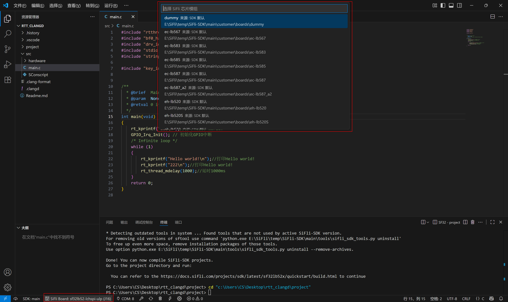

# sifli-sdk-codek**Q3: Terminal doesn't automatically enter the project folder?**

- Please ensure that a subfolder named `project` exists in the root directory.- VS Code Extension

[中文](./README.md)

`sifli-sdk-codekit` is a Visual Studio Code extension designed to simplify the development process of SiFli-SDK projects. It provides a series of convenient operation entries to help users efficiently complete project management, compilation, downloading, and configuration tasks.

---

## 🚀 Extension Version Changelog

### v1.1.3

- Added serial monitor, simple configuration of debug assistant based on serial port settings, making debug information viewing more convenient.
- Added plugin sidebar for more convenient environment setup, one-stop development.
- Added support for custom boards.

### v1.1.0

- Added SDK Manager, providing multiple different versions of SDK and their related toolchain download functions with one-click installation.
- Added SDK version switching function, users can switch between different SDK versions in the plugin, convenient for project development.
- Optimized plugin download commands, making firmware flashing more efficient and stable.
- Optimized status bar UI interface.

### v1.0.5

- Serial port switching function integrated into status bar, users can click `COM:` to select serial port, subsequent download operations will automatically use the currently selected serial port.
- Added support for serial port models other than CH340.
- Replaced original serial port download script with `sftool` command, solving the character loss problem that occurred after running in the old solution.

### v1.0.4

- Optimized overall user experience.
- Supports clicking `SiFLi Board` in the lower-left corner of the status bar to switch chip modules and select thread count.
- Also retains the method of modifying chip modules in VS Code settings interface.

### v1.0.3

- Added support for multiple SiFli chip modules, including:
  - ec series:
    - lb551xxx, lb555xxx, lb557xxx, lb561xxx, lb563xxx, lb567, lb583, lb585, lb587, lb587_a2
  - eh series:
    - lb52xu, lb56xu, lb520, lb520s, lb523, lb523_dual, lb525, lb551, lb555, lb561, lb563, ss6500, ss6700
  - sf32lb52 series:
    - core: core_52j_e8, core_52j_n16, core_base, core_e8r16, core_n16r16
    - lcd: lcd_52d, lcd_a128r16, lcd_base, lcd_n16r8, lcd_n16r8_jdi, lcd_lchspi-ulp, lcd_lchspi-ulp_base
    - nano: nano_52b, nano_52j, nano_52j_a128, nano_a128r16, nano_base, nano_n4, nano_n16r16
  - sf32lb56 series:
    - lcd: lcd_a128r12n1, lcd_base, lcd_n16r12n1
  - sf32lb58 series:
    - lcd: lcd_a128r32n1_dsi, lcd_base, lcd_n16r32n1_dpi, lcd_n16r32n1_dsi, lcd_n16r64n4

- When first activating the plugin, guide users to select chip module, note that Huangshan Pi module is `sf32lb52-lchspi-ulp`.

### v1.0.2

- Added serial port auto-identification function, automatically handling serial port devices:
  - Prompts to check connection when no serial port is available;
  - Automatically uses single device;
  - Pop-up selection box when multiple devices are present.

### v1.0.1

- Initial version, supports project compilation, download, clean, recompile, open Menuconfig and other operations.
- Automatically determines if in SiFli project, automatically saves unsaved files.
- Supports custom PowerShell path and SDK script path.

---

## 📂 Project Directory Structure

    sifli-sdk-codekit

    +---.vscode                         // VS Code configuration folder
    |
    +---images/readme                   // Usage images for the extension
    |
    +---src                             // Main entry file for the extension
    |
    +---webview-vue                     // Webview interface for the extension
    |
    +---script                          // Scripts for the extension
    |
    +---LICENSE                         // License file
    |
    +---package.json                    // Manifest file, defines extension metadata and dependencies
    |
    +---tsconfig.json                   // TypeScript configuration file
    |
    +---yarn.lock                       // Locks project dependencies to ensure consistent versions across the team
    |
    +---README.md                       // Chinese documentation
    |
    +---README_EN.md                    // English documentation

---

## ✨ Plugin Core Features

- **Automatic Recognition of SiFli Projects**
  - Recognition criteria: root directory contains `src/SConscript`
  - Plugin status bar features are only activated when conditions are met

- **Status Bar Function Buttons**
  - 

  - SDK Manager entry
  - SDK version switching
  - Select development chip module and compilation thread count
  - Select serial port device
  - Build
  - Clean and rebuild
  - Clean build artifacts
  - Flash download
  - Enter menuconfig settings interface
  - Serial monitor

- **Serial Port Auto-Recognition Mechanism**
  - Automatically detect serial port devices
  - Automatically select single device
  - Pop-up selection for multiple devices
  - Prompt user when no device found

- **SDK Manager**
  - Added SDK Manager to achieve one-click download of SDK and toolchain. SDKs downloaded through SDK Manager require no additional configuration of terminal address and SDK script path
  - Added SDK version switching function, click to quickly switch between different SDK versions

- **Command Support for Custom Boards**
  - Create boards folder at the same level as project directory to store boards, plugin can automatically recognize them, click SiFli Board to switch
  - For boards in other paths (not SDK\customer\boards, not boards folder at the same level as project), search `Sifli-sdk-codekit: Custom Board Search Path` in settings and enter the board path to complete configuration

---

## User Guide

### Install Plugin

1. Open VS Code.
2. Use shortcut `Ctrl+Shift+X` to enter the Extensions Marketplace.
3. Search for `sifli-sdk-codekit` and install.
4. Installation illustration as follows:
   

### SDK Manager Usage

- **Open SDK Manager (open through plugin sidebar or click status bar button)**
  

- **Select Installation Method**
  

- **Select SDK Download Version**
  
  - Note: When no toolchain directory path is specified, the default toolchain installation path is `C:\Users\name\.sifli`
  - When specifying tool path for download, the plugin will export environment variable `SIFLI_SDK_TOOLS_PATH` during usage

- **SDK Installation Log**
  

- **SDK Installation Complete**
  

- **Support for Users with Custom Toolchain Installation**
  

### Plugin Configuration

- **Select Chip Module and Thread Count**
  - Click `SIFLI Board` in status bar to select
  - 
  - 

---

### Serial Port Switching Demo

- **Select and Switch Serial Port Device**
  

### Command Support for Custom Boards

- **For boards folder at the same level as project**
  

- **For boards in custom paths**
  - Configure custom board path in settings
  
  
  - After configuration, boards can be viewed in the plugin
  

---

## ❓ Frequently Asked Questions (FAQ)

**Q1: Why isn't the plugin activated?**

- Please confirm whether the `src/SConscript` file exists in the project root directory.

**Q2: What to do when command execution fails?**

- Check if PowerShell path and SDK script path are correct.
- Confirm that SDK environment and dependencies (such as scons, sftool) are working properly.

**Q3: Terminal didn’t switch to the `project` directory?**

- Make sure your workspace contains a `project` folder at the root level.

**Q4: Serial port device not recognized?**

- Open Device Manager, check serial port driver, connection status, and PowerShell execution permissions.

**Q5: Other unknown issues?**

- Welcome to submit issues, this is very helpful for subsequent plugin development: [GitHub Repository](https://github.com/OpenSiFli/SiFli-SDK-CodeKit)

---
