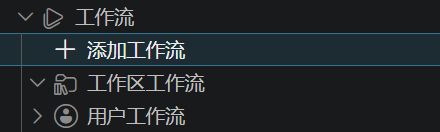
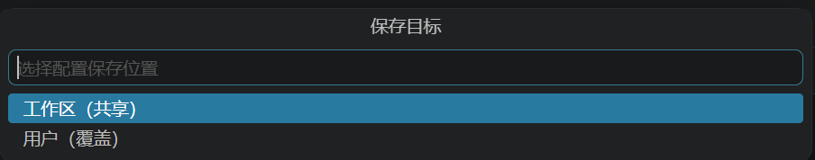
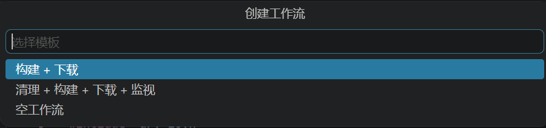
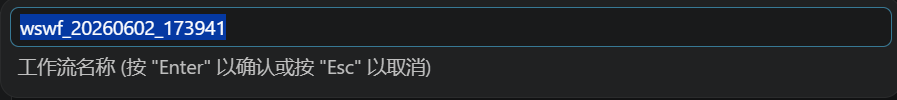
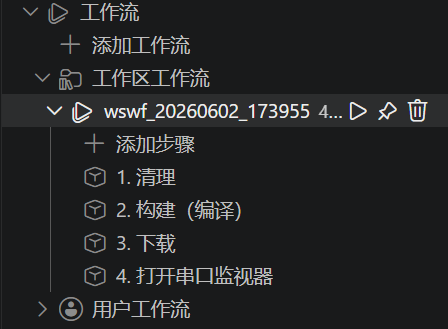
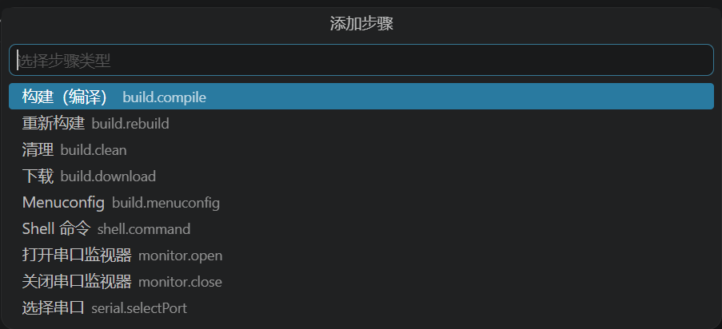

CodeKit 支持在 VS Code 侧边栏中配置动态工作流，用来把常用操作组合成一键执行的流程。例如，可以创建“构建 + 下载”工作流，也可以把清理、构建、下载和打开串口监视器串成完整流程。

## 创建工作流

在 VS Code 资源管理器侧边栏中，展开 `工作流`，点击 `添加工作流`。

首先选择配置保存位置：

- `工作区（共享）`：保存到当前工作区配置中，适合随项目共享。
- `用户（覆盖）`：保存到当前用户配置中，适合个人常用流程。

然后选择工作流模板：

- `构建 + 下载`：创建包含构建和下载步骤的工作流。
- `清理 + 构建 + 下载 + 监视`：创建完整的清理、构建、下载和串口监视流程。
- `空工作流`：先创建空工作流，再手动添加步骤。

最后输入工作流名称。CodeKit 会提供一个默认名称，也可以按实际用途修改。

创建完成后，工作流会显示在 `工作区工作流` 或 `用户工作流` 分组下，并列出当前包含的步骤。

## 添加步骤

点击工作流下的 `添加步骤`，可以继续向当前工作流追加步骤。

当前支持的步骤类型包括：

- `构建（编译）`：执行编译。
- `重新构建`：执行重新构建。
- `清理`：清理构建产物。
- `下载`：下载固件到设备。
- `Menuconfig`：打开 menuconfig。
- `Shell 命令`：执行自定义 shell 命令。
- `打开串口监视器`：打开串口监视器。
- `关闭串口监视器`：关闭串口监视器。
- `选择串口`：选择当前串口设备。

添加步骤时，可以选择是否等待当前步骤结束，以及失败后是否继续执行后续步骤。对于 `Shell 命令` 步骤，还需要输入步骤别名和要执行的命令。

## 运行和管理

工作流创建后，可以直接点击工作流旁边的运行按钮执行。也可以在工作流上右键进行重命名、复制、删除、上移或下移步骤等操作。

如果希望把某个工作流放到 VS Code 状态栏，可以使用 `固定工作流到状态栏`。固定后，点击状态栏按钮即可快速执行对应工作流。需要删除时，在`状态栏按钮-工作区/用户状态栏按钮`中选择删除。

## 绑定快捷键

工作流也可以绑定 VS Code 快捷键。右键点击工作流，选择 `设置工作流快捷键`，CodeKit 会打开 VS Code 原生的 `定义键绑定` 弹窗。在弹窗中直接按下想要绑定的组合键，例如 `Cmd+Shift+B`、`Ctrl+Shift+B` 或 `F5`，确认后即可通过该快捷键运行对应工作流。

快捷键规则会写入 VS Code 当前用户/Profile 的 `keybindings.json`，这是 VS Code 实际加载快捷键的配置位置。工作区中的工作流可以被团队共享，但快捷键本身属于个人编辑器配置，不会写入工作区目录。如果需要查看或手动调整绑定，可以在完成提示中点击 `打开 JSON`，或使用 VS Code 命令 `Preferences: Open Keyboard Shortcuts (JSON)` 打开快捷键配置。
