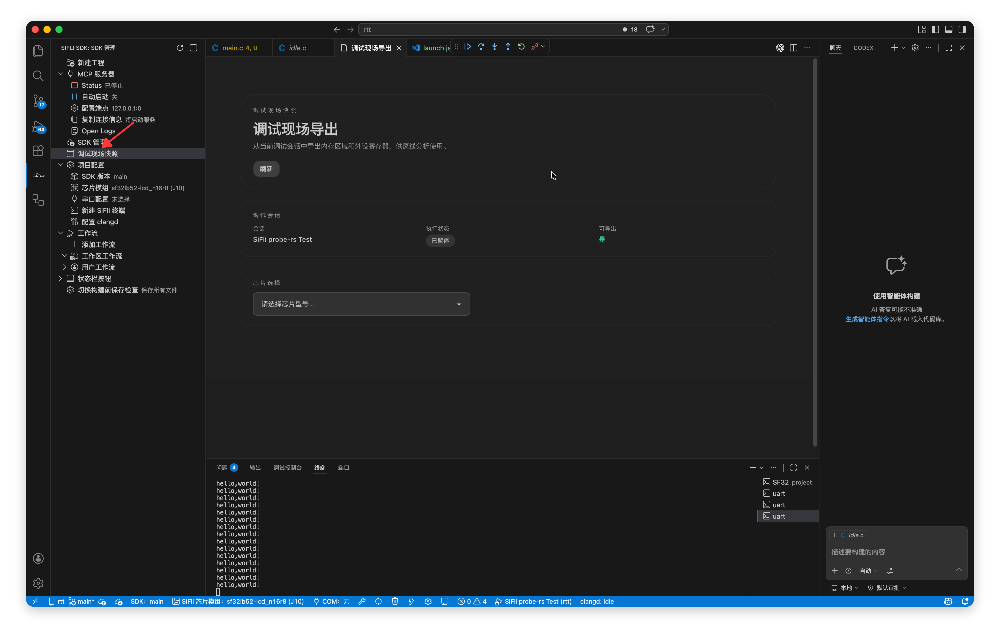
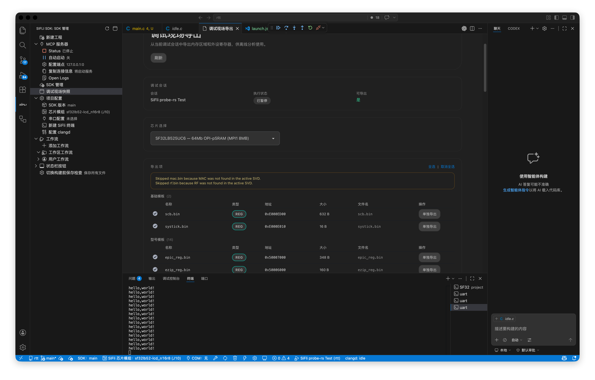
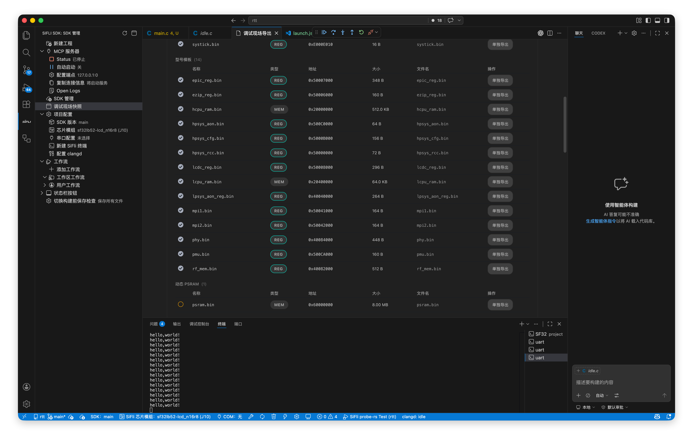
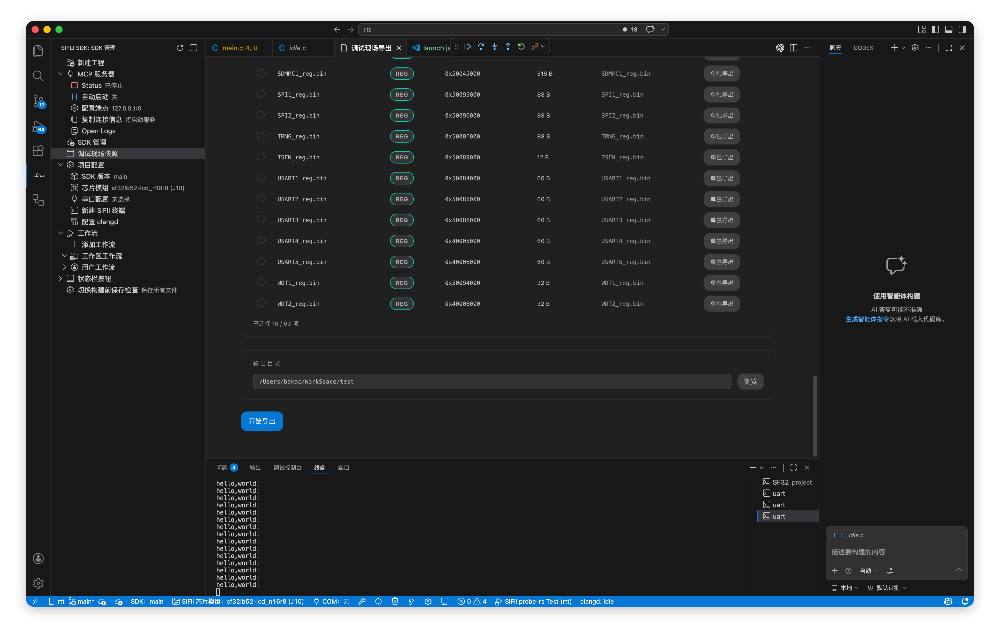
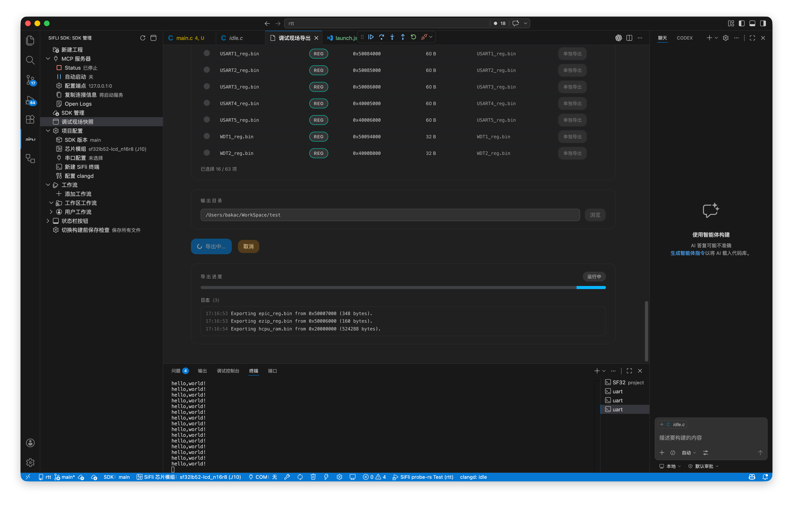
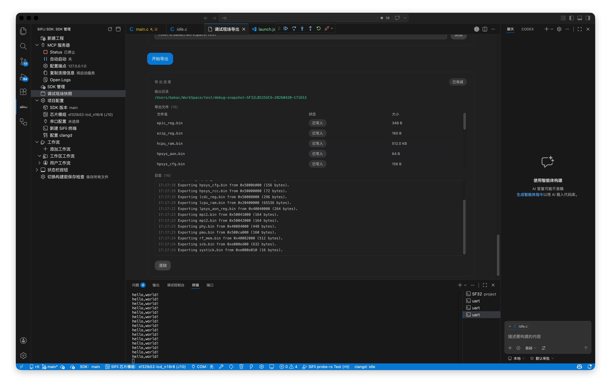

## 功能介绍

调试现场导出功能，可从当前已暂停的调试会话中导出内存区域和外设寄存器快照，方便进行问题定位和离线分析。

即使芯片已经死机，只要底层 Debug IP 仍然可访问，插件通常仍可连接当前现场并导出关键数据，这对于分析卡死、跑飞、异常中断和疑难现场问题尤其有帮助。

## 使用前提

调试现场导出依赖当前活动的调试会话，使用前需要满足以下条件：

- 已成功启动调试会话
- 当前目标处于暂停状态，例如命中断点或手动暂停
- 当前会话已加载对应芯片的 SVD 文件

::: warning

如果目标仍在运行中，插件不会允许导出。请先让程序暂停，再执行现场导出。

:::

## 打开方式

1. 启动调试并暂停。
2. 在SiFli侧边工具栏中点击调试现场快照。



## 导出流程

打开界面后，按以下步骤完成导出。

1. 确认当前调试会话状态为已暂停。

2. 选择准确的芯片型号。



3. 在导出列表中勾选需要导出的项目。



::: warning

如果勾选了 `PSRAM`，导出速度会明显变慢。建议仅在确有需要时再勾选 `PSRAM` 相关导出项。

:::

4. 选择导出文件保存的输出目录。



5. 点击`开始导出`。



导出过程中，界面会显示实时进度、日志和已生成文件。



## 导出内容

调试现场导出支持以下两类数据：

- **内存区域**：按芯片模板和当前芯片配置导出指定地址范围的数据
- **外设寄存器块**：按模板或当前 SVD 中的外设定义导出寄存器快照

导出项来源通常包括：

| 来源 | 说明 |
|------|------|
| 基础模板 | 通用芯片家族默认导出项 |
| 型号模板 | 特定芯片型号的专用导出项 |
| 动态 PSRAM | 根据芯片配置自动补充的 PSRAM 区域 |
| SVD 外设 | 根据当前 SVD 自动识别的附加外设寄存器块 |

## 导出结果

导出完成后，插件会在你选择的输出目录下自动创建一个新目录，目录名格式类似：

```text
debug-snapshot-SF32LB525UC6-20260420-171653
```

目录中通常包含：

- 各个导出项对应的二进制或寄存器数据文件
- `manifest.json`，用于记录本次导出的元信息、导出项列表、生成文件和外设寄存器快照

`manifest.json` 中会保存以下信息：

- 导出时间
- 调试会话信息
- 芯片型号
- 已导出的内存区域和寄存器块列表
- 生成文件列表
- 外设寄存器快照
- 导出告警信息

## 注意事项

- 芯片型号必须选择准确，否则模板规划的导出地址范围可能不正确
- 导出内容基于当前暂停时刻的现场状态，不会自动持续刷新
- PSRAM 容量通常较大，勾选 PSRAM 后导出速度会明显变慢，建议仅在确有需要时再导出
- 导出项越多，耗时越长，建议优先选择与问题相关的区域和外设

## 适用场景

- 现场问题难以稳定复现，需要先保存芯片当前状态
- 芯片已经死机，但 Debug IP 仍然可访问，需要尽快保存故障现场
- 需要把问题现场交给其他同事或研发团队离线分析
- 希望先导出关键数据，再进一步排查问题
