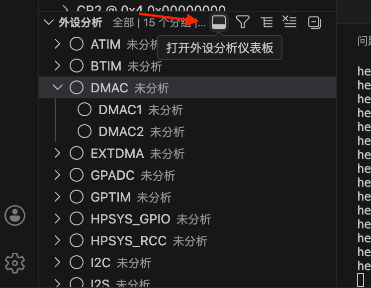
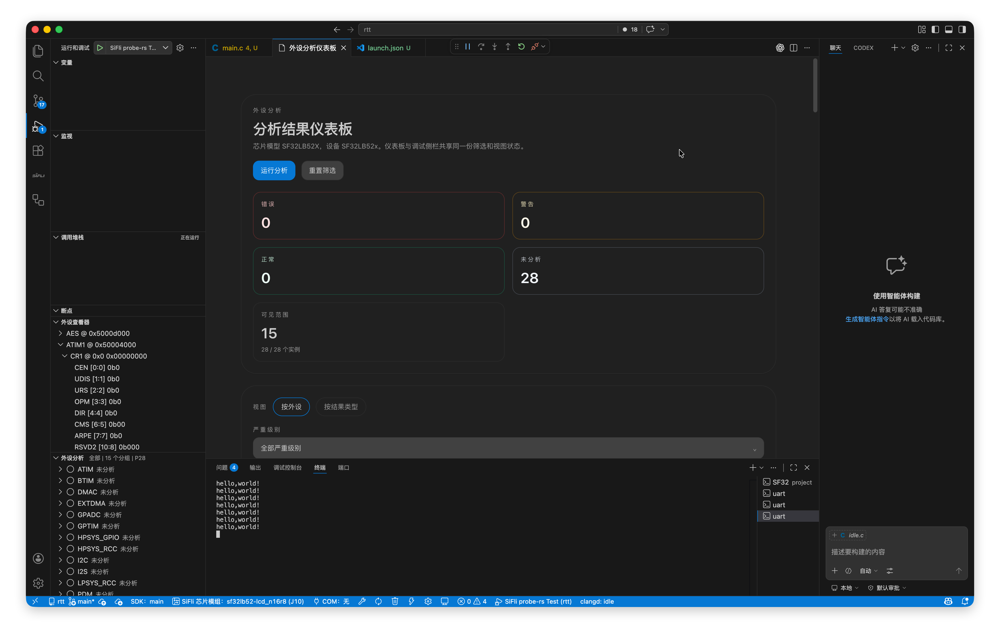
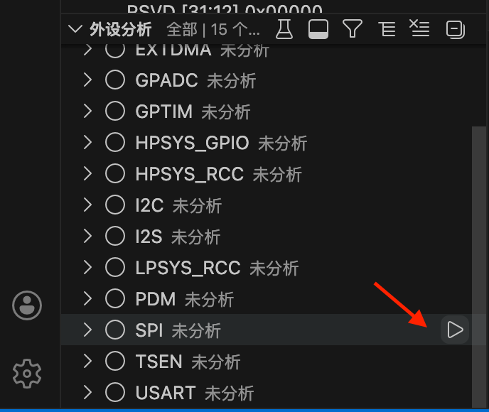
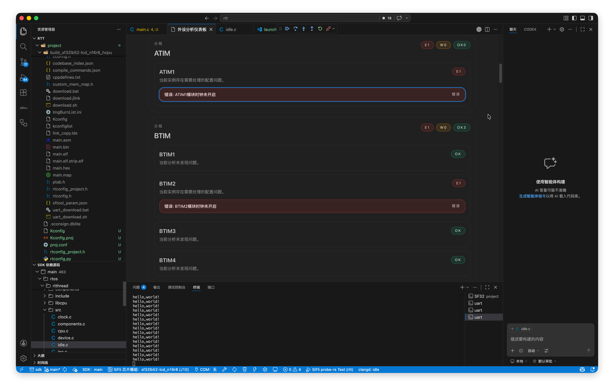

## 打开分析面板

启动调试后即可看到外设分析面板，不需要先暂停目标。

1. 先启动调试会话。

2. 在外设分析栏的右上角工具栏中点击打开外设分析面板图标

## 执行分析

执行分析前，需要先让目标暂停。调试运行过程中可以看到分析面板，但不能直接开始分析。

### 全量分析

点击面板中的**运行分析**按钮，对当前芯片所有已支持的外设组执行一次完整分析。

### 按组分析

点击某个外设组旁的**运行**按钮，可单独分析该组外设，例如仅分析 SPI。

## 查看分析结果

分析完成后，结果会按外设分组展示。每条发现包含：

| 字段 | 说明 |
|------|------|
| 严重程度 | **Error**（错误）/ **Warning**（警告）/ **Info**（信息） |
| 外设名称 | 触发该条规则的具体外设和寄存器 |
| 描述 | 问题的简要说明 |

## 筛选与视图切换

- 点击 **Set Filters** 可以按严重程度或外设组过滤结果
- 点击 **Switch View** 可以在“按外设分组”和“按严重程度分组”两种视图间切换
- 点击 **Reset Filters** 清除当前筛选条件

::: tip

IP 分析基于当前暂停时读取到的寄存器快照。建议在初始化完成后暂停，此时分析结果通常更准确。

:::
