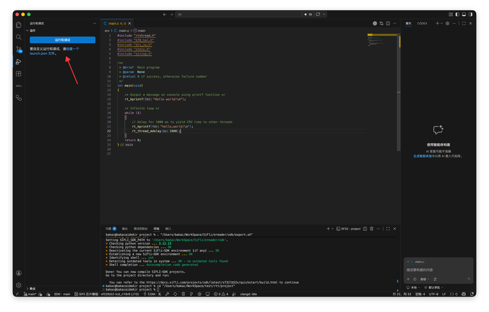
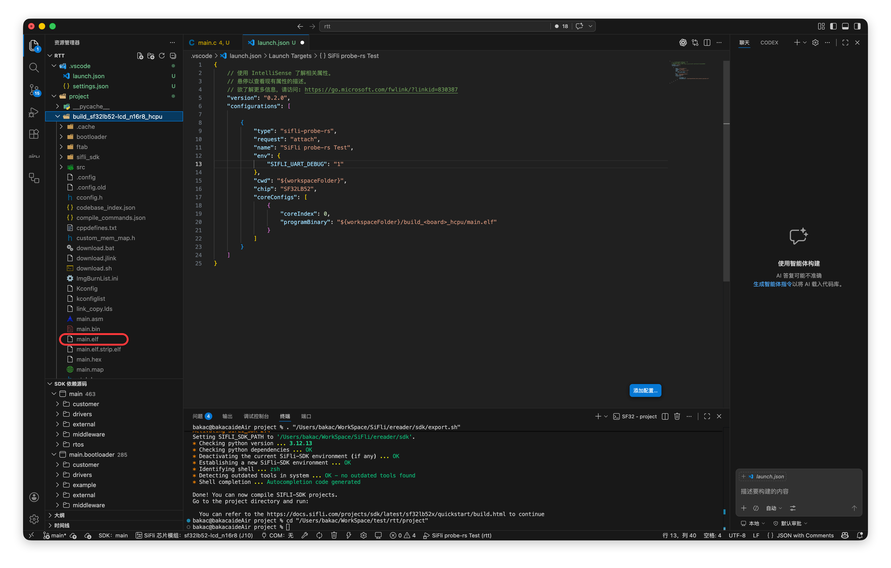
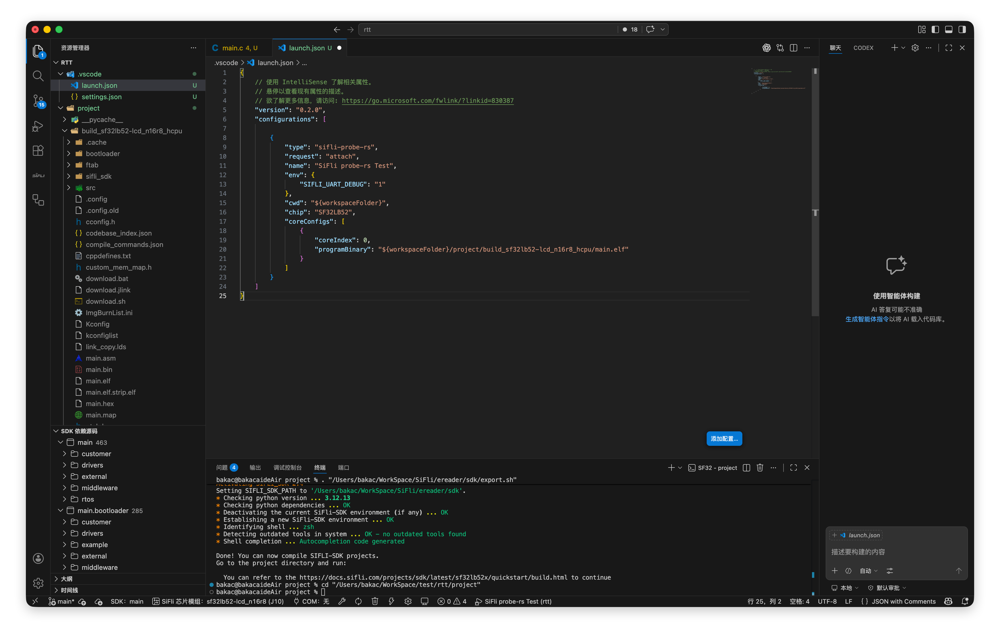
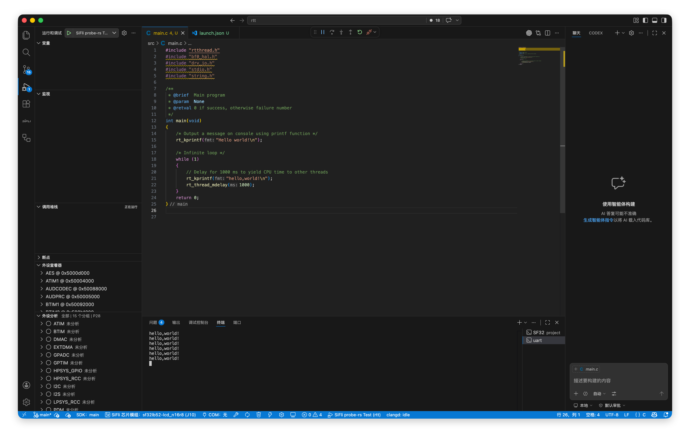

## 新建 launch.json

创建调试配置时，VS Code 会自动在工程根目录下生成 `.vscode/launch.json` 文件。

1. 在 VS Code 侧边栏切换到运行和调试视图（`Ctrl+Shift+D` / `⇧⌘D`）。

2. 点击创建 launch.json 文件，在弹出的调试器列表中选择 SiFli probe-rs Debug: Attach。



3. VS Code 会自动在工程根目录的 `.vscode/` 下生成 `launch.json`。

## 默认模板说明

生成后的默认配置如下。

::: warning

自动生成的 `launch.json` 还不能直接用于调试。

要正常启动调试，还需要继续按照后续教程修改配置，重点是确认 `programBinary` 指向正确的调试文件路径。

:::

```json
    // 使用 IntelliSense 了解相关属性。 
    // 悬停以查看现有属性的描述。
    // 欲了解更多信息，请访问: https://go.microsoft.com/fwlink/?linkid=830387
    "version": "0.2.0",
    "configurations": [
        
        {
            "type": "sifli-probe-rs",
            "request": "attach",
            "name": "SiFli probe-rs Test",
            "env": {
                "SIFLI_UART_DEBUG": "1"
            },
            "cwd": "${workspaceFolder}",
            "chip": "SF32LB52",
            "coreConfigs": [
                {
                    "coreIndex": 0,
                    "programBinary": "${workspaceFolder}/build_<board>_hcpu/main.elf"
                }
            ]
        }
    ]
}
```

各字段含义如下：

| 字段 | 说明 |
|------|------|
| `type` | 固定为 `sifli-probe-rs`，指定使用 SiFli 调试适配器 |
| `request` | 固定为 `attach`，表示附加到正在运行的目标 |
| `name` | 调试配置的显示名称，可自由修改 |
| `env.SIFLI_UART_DEBUG` | 启用 SiFli UART 调试探针模式，通常保持为 `"1"` |
| `cwd` | 调试工作目录，默认为工程根目录 |
| `chip` | 目标芯片型号，需与实际硬件一致 |
| `coreConfigs` | 每个核心的调试配置列表 |
| `coreConfigs[].coreIndex` | 核心编号，HCPU 为 `0` |
| `coreConfigs[].programBinary` | 调试用 ELF 文件路径 |

## 修改调试文件路径

创建完 `launch.json` 后，还需要修改 `programBinary` 路径，否则无法正常启动调试。

1. 先确认工程编译输出目录中实际生成的 `main.elf` 路径。



2. 在 `launch.json` 的 `coreConfigs` 中，将 `programBinary` 替换为实际构建产物的路径。



::: tip

可以在 VS Code 左侧文件树中右键 `main.elf`，选择复制相对路径，然后只替换 `${workspaceFolder}/` 后面的内容。

:::

::: warning

请勿使用 `main.strip.elf` 文件进行调试。`main.strip.elf` 已移除调试符号，无法正常设置断点、查看变量和显示调用栈。

调试时请始终使用 `main.elf`。

:::

3. 修改完成后，确认生成的调试配置与当前工程输出目录一致，再返回**运行和调试**视图启动调试。

