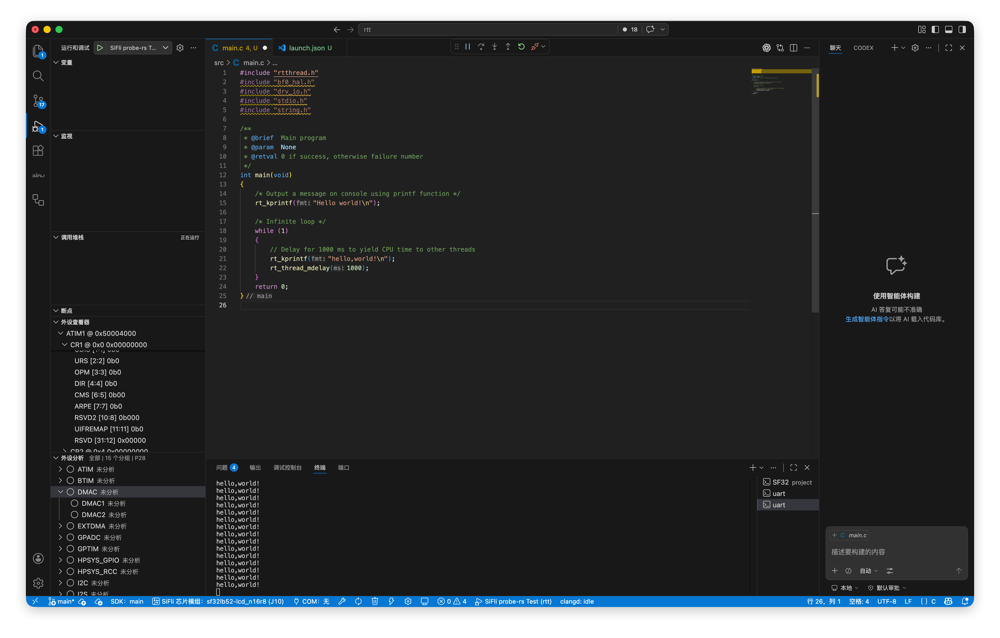

## 打开寄存器视图

启动调试后即可看到外设寄存器面板。

1. 先启动调试会话。

2. VS Code 侧边栏的**运行和调试**视图底部会自动出现**外设寄存器**面板。

## 查看寄存器值

调试运行过程中也可以查看寄存器值。

1. 展开对应外设节点。

2. 查看寄存器及字段的当前值。

3. 如果需要读取最新值，可以在暂停状态下查看，或在运行状态下手动刷新。

::: tip

寄存器值在**调试暂停**时会自动刷新。在程序运行期间，也可以通过手动刷新读取最新值。

:::
