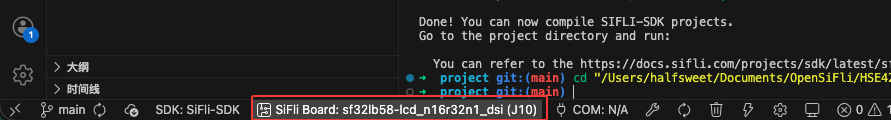
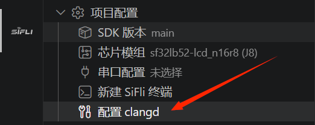

点击状态栏中的板子配置按钮，选择对应的开发板型号进行配置。



## 配置 clangd

如果需要使用 clangd 提供 C/C++ 代码补全、跳转和诊断，可以在 VS Code 资源管理器侧边栏的 `项目配置` 中点击 `配置 clangd`。



CodeKit 会根据当前选择的芯片模组更新工作区的 `clangd.arguments`，将 `--compile-commands-dir` 指向当前工程的构建目录，例如：

```text
${workspaceFolder}/project/build_<芯片模组>_hcpu
```

同时，CodeKit 会在工作区根目录写入或更新 `.clangd` 文件，使 clangd 能够读取对应的编译数据库和 SiFli 工具链信息。

第一次配置前，建议先完成一次正常编译，确保构建目录下已经生成 `compile_commands.json`。切换芯片模组后，或重新生成了不同芯片模组的构建目录后，请再次点击 `配置 clangd`，并按提示重启 VS Code 使配置生效。
