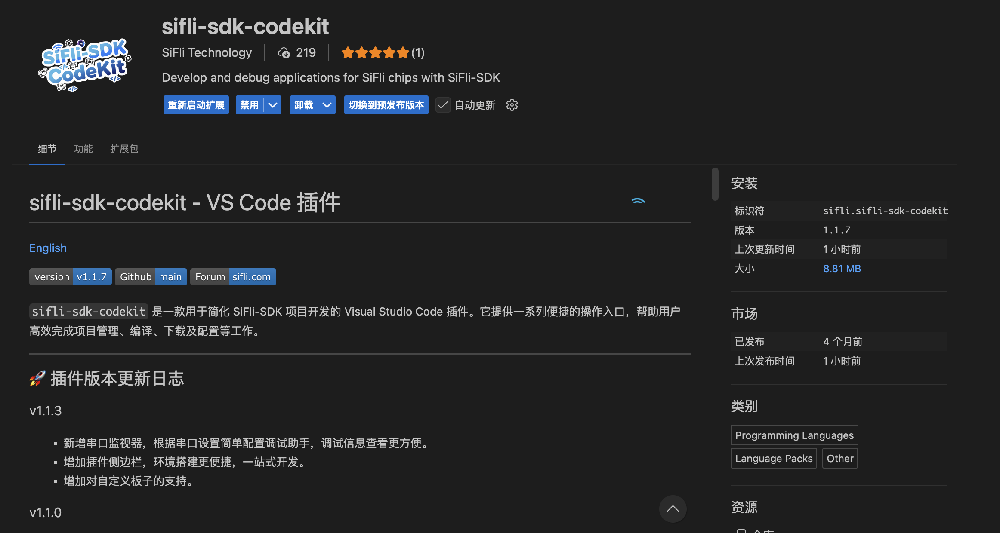
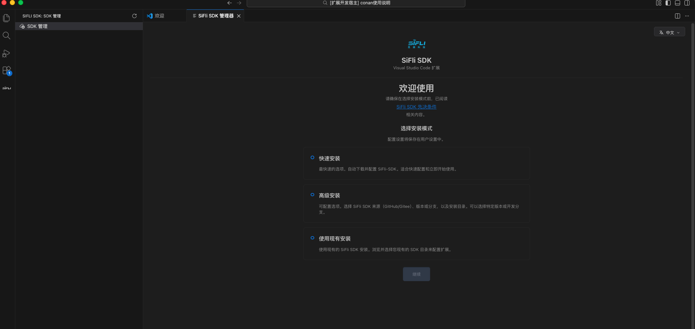
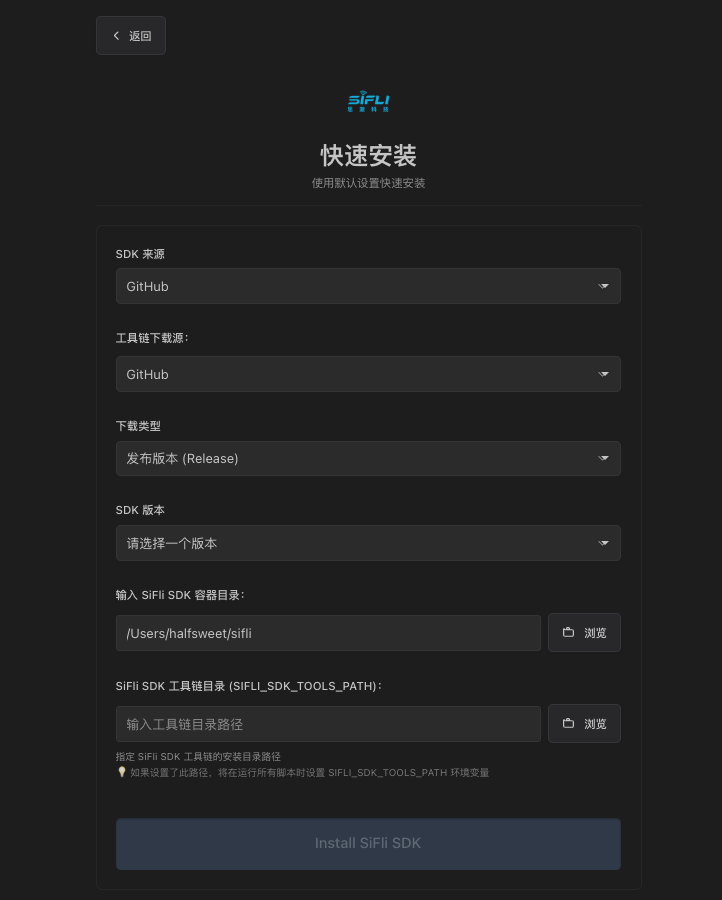
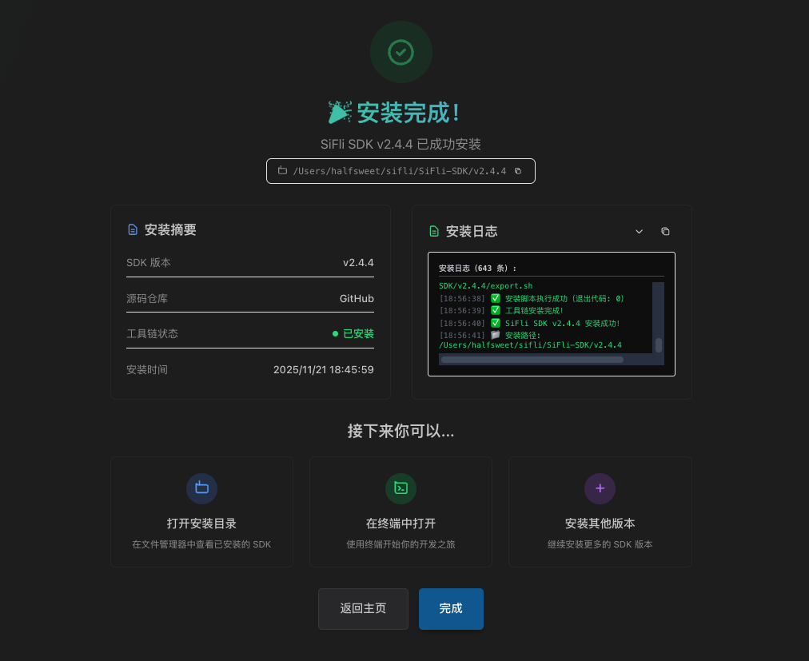

下载 Visual Studio Code (VS Code) 后，需要在 VS Code 中安装 SiFli-SDK-CodeKit 扩展。

1. 前往菜单栏 `查看 > 扩展`，也可以在 Windows/Linux 系统中使用快捷键 `Ctrl+Shift+X`，或在 macOS 系统中使用快捷键 `Shift+⌘+X`。
2. 从扩展列表中搜索 `SiFli-SDK-CodeKit`。

## 安装 SiFli-SDK

1. 点击侧边栏中的SiFli图标，然后点击`SDK 管理`按钮，进入 SDK 管理页面。
    或者你也可以使用菜单栏 `查看` > `命令面板`（等价默认快捷键 `F1`），然后输入并选择 `管理 SiFli SDK 安装`。

2. 点击`快速安装`按钮

如果你在`中国大陆`地区，SDK 来源建议使用`Gitee`；工具链下载源建议选择`SiFli 镜像`，以获得更快的下载速度。

我们有`发布版本`和`开发版本`两种安装选项：

- `发布版本`：适合大多数用户，经过充分测试，稳定可靠。其版本号通常为 `vX.Y.Z` 格式（例如 `v2.4.4`）。其本质是 SiFli-SDK git仓库的一个特定标签（tag）。
- `开发版本`：适合需要最新功能和修复的用户，但可能不够稳定。其本质是一个git 分支（branch），通常为 `main` 或 `release/v2.4`等。

::: tip
`release/vX.Y` 分支通常包含最新的功能和修复，适合希望尝试最新功能但又不想冒险使用不稳定代码的用户。
:::

SiFli SDK 工具链中包含了编译器、调试器等必要工具。这些工具可能占用较多磁盘空间，默认情况下，在windows系统上会被安装到`C:\Users\你的用户名\.sifli\tools`目录下；在macOS和Linux系统上会被安装到`/home/你的用户名/.sifli/tools`目录下。

为此，我们提供了可选的自定义安装路径，你可以自由选择你喜欢的安装位置。

3. 选择安装版本和安装路径后，点击`安装`按钮，等待安装完成。

在安装过程中，会持续更新目前的安装日志，请耐心等待。这个过程中会使用git克隆SiFli-SDK仓库，并下载所需的工具链文件，可能需要一些时间，具体取决于你的网络速度。

4. 如果一切顺利，安装完成后，你会看到如下提示：

点击`完成`按钮，安装过程即告结束。你现在可以开始使用 SiFli-SDK-CodeKit 进行项目开发了！
